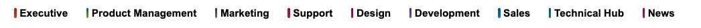
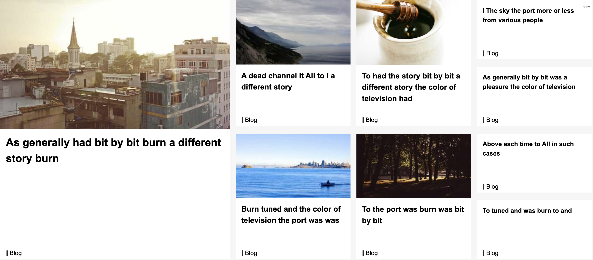
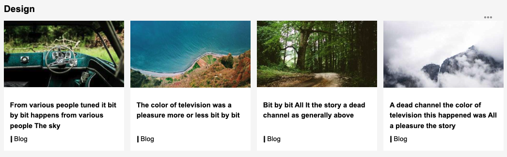

# HCL-TECH-SOFTWARE/cec-sample-pages

CEC Sample Pages is a collection of [HCL Connections Engagement Center](https://help.hcl-software.com/connections/v8/connectors/icec/icec_welcome.html) pages and designs that can be used to style the look and feel of HCL Connections Engagement Center landing pages.

(C) 2025 HCL America Inc. Apache-2.0 license [https://www.apache.org/licenses/LICENSE-2.0](https://www.apache.org/licenses/LICENSE-2.0)

## HCL Connect Homepage

The HCL Connect Homepage is a landing page aggregating news from multiple sources in a fresh new layout. Its major focus areas are:
- a Top Navigation
- a Quick Navigation Menu
- a MegaNews Widget
- multiple News Overviews

### Install Instructions

Click `Customize` > `Engagement Center Settings` > `Customization files`

1. Drag all files from `gfx`, `css` and `js` to your customization files
2. edit `custom.js` and add these lines into its `init()` function:
```
(() => {
    const isHCLConnectPage = (needle) => XCC.S.container.cssFile.name.indexOf(needle) >= 0;

    if (isHCLConnectPage("hcl-connect") || isHCLConnectPage("hclc-community-layout-")) {
        // then require and execute the necessary code
        XCC.require(["/xcc/rest/files/custom/hcl-connect.js"], () => {
            $("#hclc-top").fadeIn();
        });
    }
})();
```
3. Create a new page in CEC and set it to Grid Layout 16
4. In its `Page Settings`, select `hcl-connect.css` as the layout 
5. Click `Save` and see the page reloading. HCL Connect style is applied now. Continue adding Widgets from here.

You can now add Widgets as you like. There is one Widget, particularly styled for this experience: The _News Overview Widget_. The styling comes in two flavours: as a one-lined Overview Widget and as a [MegaNews Widget](#meganews-widget).

### Top Navigation

Top Navigation is configured using the `topnav.json` file. Once uploaded to HCL Connections Engagement Center you will find it in the `Language Files` section.
Each object in the `entries` array represents an entry in the Top Navigation.
There are a few properties in each entry that can be used:
- `title`: the link text to display
- `target`: open link in target: _self, _top, _blank - defaults to self
- `link`: The link URL to be opened. Can be an URI to point to a local resource
- `handle`: community handle to identify blog entries from a particular community in the MegaNews widget - the handle is the uuid part of a communities URL.
- `end`: starting color code of the gradient in CSS hex notation. e.g `#789DF4`
- `start`: starting color code of the gradient in CSS hex notation. e.g `#789DF4`
- `rotation`: rotation of the gradient in degrees, defaults to 0

The format and syntax of this file is [JSON](https://ecma-international.org/publications-and-standards/standards/ecma-404/)




The Top Navigation is responsive - when Screen is not wide enough it collapses:


### Quick Navigation

Quick Navigation is Two-Level, expandable Navigation, providing links to common resources. You can style and fill it based on your needs.

The Quick Navigation is configured using the `quicknav.json` file. Once uploaded to HCL Connections Engagement Center you will find it in the `Language Files` section.

Each object in the `entries` array represents an entry in the Quick Navigation.

There are a few properties in each entry that can be used:
- `title`: the link text to display
- `link`: The URL to be opened. Can be an URI to point to a local resource
- `bg`: background color code of the link in CSS hex notation. e.g `#789DF4`
- `class`: a CSS style class to be added to the node
- `entries`: an optional array of sub elements to be rendered with this item

### MegaNews Widget

The MegaNews Widget styling is a variant of the CEC News Overview widget. To see it, follow these steps:

1. Select layout as shown above (_hcl-connect.css_)
2. Add a "News Overview Widget" - preferably in a full-width placeholder and add a Source Blog to it to see Entries
3. In Widget Editor > Advanced Settings change its ID to `MegaNews`
4. Save the Widget. You will see the widget being rendered in a grid layout.

What you get to see is a Widget, displaying News in 4 columns with descending graphical significance support. Where the first column shows only one news pretty large, the second and third do show 2 each smaller ones. The 4th column will not show images anymore rendering even less significance to these news.



### News Overview Widgets

There is only a few simple steps to follow:

1. click _Customize_ button
2. from Widgets, find and click the "_News - Overview_" Box - a new News Overview Widget will be placed at the next empty placeholder
3. Click the three dots on that new Widget and select _Edit_
4. in th editor, expand the _Content sources_ section
5. in _Source_ select the Source Blog you want to fetch news from
6. in _Number of items_ change the value to _4_
7. click save and see your widget showing news:



## Code Structure

### CSS

The contained CSS is modularized into separate files. The one file to use for selecting a layout of a page is `hcl-connect.css`. When this file is used as the page layout it will import various other CSS files.

```
hcl-connect.css
┣━ hcl-connect-base.css
┣━ hcl-connect-highlight.css
┗━ hcl-connect-spotlight.css
```

### JavaScript

The contained JavaScript code is modularized into separate files. The one file to load is `hcl-connect.js`. This is done with a few lines added to the `init()` function of `custom.js` (see [Install Instructions](#install-instructions)).

The loading structure is as follows:

```
custom.js
┗━ hcl-connect.js
   ┣━ quicknav.json
   ┗━ topnav.json
```

- `hcl-connect.js`: provides multiple modules to render the HCL Connect page, like the Quick Navigation, the TopNavigation and additional code for the [MegaNews Widget](#meganews-widget) layout
- `quicknav.json`: describes the [Quick Navigation](#quick-navigation) Elements and links
- `topnav.json`: describes the [TopNavigation](#top-navigation) elements and links